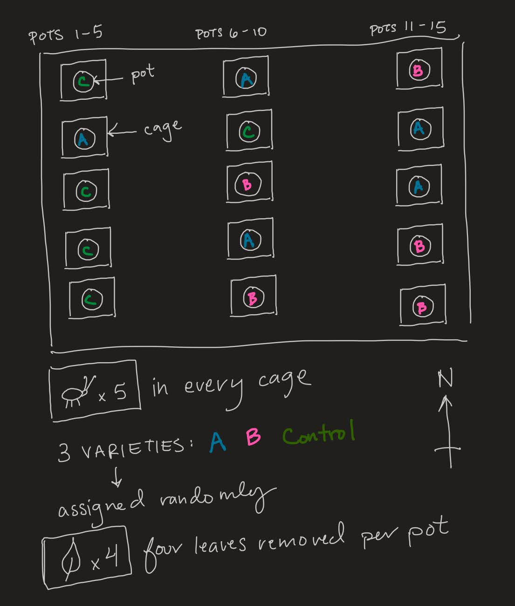

```{r echo=FALSE,message=FALSE, warning=FALSE}
WITH_CHUNKS = TRUE
library(ggplot2)
library(emmeans)
library(lme4)
library(lmerTest)
library(multcomp)
library(PLS205)
```

# Instructions

- **Be sure to read every question carefully and answer all parts.**
  - **Clarification questions should be posted to Piazza.** Please avoid posting answers, though! No consultation with other students or outside experts is allowed during the exam period (including R programming). You may use any notes / printed material / online resources. You can consult with me or the TAs about R programming.
- **Include all `R` code used to answer each question.** Be sure to include a command so that your results are printed out to the knitted output. This means that if you save your answer in an object like `ans_4.1`, be sure to "print" this object by typing it in a separate line at the end of the `R` code chunk
- Some questions can be answered without any `R` code.
- **Every result should include a discussion.** Full points require a sentence explaining the conclusion.
- **Use http://www.tablesgenerator.com/markdown_tables to easily convert excel tables to markdown** You can create your model tables in Excel, paste them into the website, and then copy the correctly formatted table back into this document.


# Question 1


An experiment was run to compare four chemicals for their ability to control a soil-borne disease in strawberry.
The experiment was done in the field in a completely randomized design with chemicals applied independently to plots.
At the end of the experiment, each plot was given a score from 1-9 for disease severity.
Results for each of the 4 chemicals are presented in the table below:

| Treatment | Control | A   | B   | C   |
|-----------|---------|-----|-----|-----|
| n_i       | 6       | 6   | 6   | 6   |
| μ_i       | 7.8     | 1   | 4.2 | 6.2 |
| s2_i      | 2.2     | 1.2 | 2.2 | 1.8 |

## 1.1 Calculate the pooled estimate of the variance of experimental units given the table above. 
Explain WHY we use a pooled estimate we generally use a pooled estimate of the variance of experimental units, under what conditions we should not use a pooled estimate, and if you'd recommend doing that here or not.
```{r}
# table as objects

s2_control <- 2.2
s2_A <- 1.2
s2_B <- 2.2
s2_C <- 1.8

strawberry_means <- c(7.8, 1, 4.2, 6.2)

s2_i <- c(2.2, 1.2, 2.2, 1.8)
n_i <- c(6,6,6,6)

# Calculating the pooled variance

s2_pooled <- ((5*s2_control) + (5*s2_A) + (5*s2_B) + (5*s2_C)) / (5*4)
s2_pooled

# checking variance assumption
#  calculating the standard deviation
s_control <- sqrt(s2_control)
s_A <- sqrt(s2_A)

variance_check <- s_control / s_A
variance_check
```

> [8 points] Pooled Variance = 1.85  If we expect the variance of each treatment group to be the same, even though the means may be different, we can use a pooled estimate of the variance. A pooled extimate is useful because it can increase the power of our statistical tests without having to dramatially increase our repeated measures per treatment. In this case, the variance of each treatment (s2_i) are reasonably similar and we have no reason to expect some of the chemicals to cause higher variance than others, so it is appropriate to use the pooled variance. If there was more variation in the variances between treatments, then a pooled variance would be inappropriate.

## 1.2 Calculate a 95% confidence interval for the difference between chemical A and the Control
Use the pooled estimate of the EU variance from above. Be sure to include units.

```{r}
# Calculating t
t_critical <- qt(p = .05/2, 20, lower.tail = F)
t_critical

CI_control.vs.A_add <- (7.8 - 1) + t_critical * sqrt(s2_pooled) * sqrt( 1/6 + 1/6)
CI_control.vs.A_add

CI_control.vs.A_sub <- (7.8 - 1) - t_critical * sqrt(s2_pooled) * sqrt( 1/6 + 1/6)
CI_control.vs.A_sub

```

> [8 points] The 95% CI is 5.05 to 8.55 disease severity. To be clear, the units are disease severity (scale of 1-9).

## 1.3 Determine which of the three chemicals can be declared significantly different from the control with $\alpha = 0.05$.
The following table gives critical values for $\alpha = 0.05$ for four different multiple-test correction methods. 

| Method     | t_critical |
|------------|------------|
| Tukey      | 2.799      |
| Dunnett    | 2.558      |
| t          | 2.086      |
| Bonferroni | 2.613      |

```{r}
# inputting t-values
t_tukey <- 2.799
t_Dunnett <- 2.558
t_crit <- 2.086
t_bonferroni <- 2.613

# inputting means

# calculating Tukey CIs
Tukey_ctrl.vs_add <- (7.8 - strawberry_means[2:4]) + t_tukey * sqrt(s2_pooled) * sqrt( 1/6 + 1/6)
Tukey_ctrl.vs_add

Tukey_ctrl.vs_sub <- (7.8 - strawberry_means[2:4]) - t_tukey * sqrt(s2_pooled) * sqrt( 1/6 + 1/6)
Tukey_ctrl.vs_sub

# calculating Dunnet CIs
Dunnet_ctrl.vs_add <- (7.8 - strawberry_means[2:4]) + t_Dunnett * sqrt(s2_pooled) * sqrt( 1/6 + 1/6)
Dunnet_ctrl.vs_add

Dunnet_ctrl.vs_sub <- (7.8 - strawberry_means[2:4]) - t_Dunnett * sqrt(s2_pooled) * sqrt( 1/6 + 1/6)
Dunnet_ctrl.vs_sub

# calculating t-test CIs
ttest_ctrl.vs_add <- (7.8 - strawberry_means[2:4]) + t_crit * sqrt(s2_pooled) * sqrt( 1/6 + 1/6)
ttest_ctrl.vs_add

ttest_ctrl.vs_sub <- (7.8 - strawberry_means[2:4]) - t_crit * sqrt(s2_pooled) * sqrt( 1/6 + 1/6)
ttest_ctrl.vs_sub

# calculating Bonferroni CIs
bonferroni_ctrl.vs_add <- (7.8 - strawberry_means[2:4]) + t_bonferroni * sqrt(s2_pooled) * sqrt( 1/6 + 1/6)
bonferroni_ctrl.vs_add

bonferroni_ctrl.vs_sub <- (7.8 - strawberry_means[2:4]) - t_bonferroni * sqrt(s2_pooled) * sqrt( 1/6 + 1/6)
bonferroni_ctrl.vs_sub


```

> [8 points] Because we are comparing each of the three chemical treatments to the control, Dunnett's method is the appropriate one to use, as it increases our statistical power. This is achieved by minimizing the number of comparisons (when compared to Tukey, t test, or Bonferroni). Using this method, only treatment C crosses zero (3.6 to -0.4), indicating that it is not significantly different from the control. The other two treatments, (A, 8.8 to 4.8 and B, 5.6 to 1.6) do not cross zero and are thus significantly different from the control.
> If, however we were to use the other three methods, we would find similar results, with treatment C as the only treatment that does not differ significantly from the control.

## 1.4 Say that we randomly lost 3/6 samples of chemical A. How would the confidence interval for (A-Control) change? 
Report the new confidence interval (do not use a multiple testing correction).
Note: the new pooled_s2 is: 1.83 and the new μ_A = 0.67

```{r}
# new pooled est. of variance and mean of A as objects
s2_pooled_new <- 1.83
mean_A <- 0.67

# Calculating t
t_critical_new <- qt(p = .05/2, 17, lower.tail = F)
t_critical_new

# Calculating the CI
CI_control.vs.A_add <- (7.8 - 0.67) + t_critical_new * sqrt(s2_pooled_new) * sqrt( 1/3 + 1/6)
CI_control.vs.A_add

CI_control.vs.A_sub <- (7.8 - 0.67) - t_critical_new * sqrt(s2_pooled_new) * sqrt( 1/3 + 1/6)
CI_control.vs.A_sub

```

> [6 points] The new confidence interval would be 9.15 to 5.11 disease severity, a confidence interval that is ~13% wider than the previously reported CI for control vs. A. This is because the decresed sample size increases the t-critical value and changes the denominators in the SED (the number of samples per treatment A). This also decreases our statistical power.

-------------------------------------------------------------------------------


# Question 2


Two new pumpkin varieties have been released with claims of some resistance to squash bugs. 
Apparently, an abundance of trichomes on the lower leaf surfaces deters mature females from laying eggs. 
To evaluate their effectiveness, the two varieties plus a control were planted randomly into 15 pots in a lath house. 
Each pot contained one plant and was enclosed in a netting with 5 female squash bugs.
The pots were laid out in 3 rows of 5 (pots 1-5 in row 1 near the west wall, 6-10 in the center and 11-15 near the east wall).
At the end of six weeks, 4 leaves were removed from each plant, and the number of eggs on the underside of each leaf was recorded.


```{r}
eggs_data = read.csv('~/Desktop/R_Projects/PLS205_Winter2021/PLS205_Winter2021/data/Eggs_data.csv',stringsAsFactors = TRUE)
str(eggs_data)
```

## 2.1 Draw a diagram of the experimental design
Look carefully at the data table above (you can use `View(eggs_data)`, or open in Excel). Your diagram can be very abstracted, but I want to see your interpretation of the overall layout, and levels of sampling. Be as precise as you can given the description above and the information in the data table. Do you see any issues with this experimental layout?

You can either draw using a digital drawing tool, or you can draw on paper, take a picture, and upload your picture. Just save the file in the same directory as this file, and then change the file name below to include the figure:



> [8 points] I have some concerns about this experimental design. It is possible that location within the lath house (East, Middle, or West) might affect the plants or insects due to light and/or temperature effects from the sun. Initially, I believed that assigning pots randomly would mitigate the effects that location within the lath house may have, but after writing in the pots, it became clear the 4/5 of the control treatments had ended up on the West side of the lath house. This may cause bias in the control treatment. A different layout or assignment method may be able to mitigate this.

## 2.2 Describe the design of this experiment in detail.
Provide an explanation for your choice of experimental unit for the treatment(s).

| Structure | Variable   | Type        | # levels | Experimental Unit |
|-----------|------------|-------------|----------|-------------------|
| Treatment | Variety    | Factor      | 3        | Pot               |
| Design    | Pot        | Factor      | 15       |                   |
| Design    | Leaf       | Factor      | 60       |                   |
| Response  | Eggs       | Numeric     | 60       |                   |

> [8 points] The experimental unit is Pot. The treatment (Variety) is applied at the pot level and is assigned to each pot randomly and independently. The pots are interspersed throughout the lath house and are grown at the same time. The proximity of the pots to other pots should not affect nearby pots, as they are separated by cages. Additionally, the variables Pot and Leaf will need to be converted from numeric to factor.

## 2.3 Fit an appropriate linear model to the data
Do not do any transformation to the response yet.
Declare why you chose `lm()` or `lmer()` for your model
```{r}
# converting Pot and Leaf from numeric to factor
eggs_data$Pot_f <- as.factor(eggs_data$Pot)
eggs_data$Leaf_f <- as.factor(eggs_data$Leaf)

# fitting the model
eggs_model <- lmer(eggs ~ (1|Pot_f) + Variety, data = eggs_data)

```

> [8 points] To build this model, I put in every treatment and design variable with more levels than the response variable. This meant that I did not include Leaf, but did include Pot and Variety. Because Pot is the EU, I had to declare it using (1|Pot_f) and use the lmer() function.

## 2.4 Check the necessary model assumptions using diagnostic plots and determine if a data transformation is necessary
End by re-fitting with your final model if you choose to use a transformation.
```{r}
# checking the model assumptions
pls205_diagnostics(eggs_model, EU = 'Pot_f')

# trying transformations
# log because of the increasing slope in the scale-location plot
eggs_data$eggs1 <- eggs_data$eggs + 1
eggs_log <- lmer(log(eggs1) ~ Variety + (1|Pot_f), data = eggs_data)

pls205_diagnostics(eggs_log, EU = 'Pot_f')

# sqrt because we are working with count data
eggs_sqrt <- lmer(sqrt(eggs) ~ Variety + (1|Pot_f), data = eggs_data)

pls205_diagnostics(eggs_sqrt, EU = 'Pot_f')
```
> [8 points] The untransformed data's Q-Q plot suggests that the data is mostly normal, but the outliers (3 and 9) indicated to me that a transformation might be appropriate. In the scale-location plot, the residuals are largely the same. The slope of the red line indicates that there is higher variation in varieties with higher egg counts, though this is weakly indicated. This trend suggested a log transform may be appropriate. Curious to see if these could be improved, I perfomed a log transform (because of the scale-location plot) and a square root transform (because these are count data). The log-transform brought in the outliers and generally improved the linearity for the Q-Q plot, but the improvement was not particularly dramatic. The transformed Scale-Location plot improved, with less of the slope observed in the untransformed plot. The square root transofrmation had similar effects, although was perhaps a bit worse (it sent a few points closer to our bounds/outlier territory). It did not decrease the slope of the scale-location plot as well as the log transform. As a result, I decided to stick with the log transform, though either method improved on the untransformed model.

## 2.5 Using your final model, decide whether you can recommend either of these varieties for improved squash bug resistance relative to the control.
Use alpha = 0.05 for your decision. 
```{r}
eggs_means <- emmeans(eggs_log, specs = 'Variety')

summary(contrast(eggs_means, method='trt.vs.ctrl', ref = 3), level = 0.95, infer = c(T,T), type = 'response')

```
> [8 points] Using Dunnett's method and our log-transformed model, I can recommend Variety B when compared to the control. The confidence interval does not cross zero (0.0521 to 0.471) and the p-value is low (0.022), indicating that there is enough evidence to reject the null hypothesis (that there is no difference between the control and Variety B). While Variety A's CI also does not cross zero, the p-value is high, indicating that there is not sufficient evidence to reject the null (that there IS a difference between the control and Variety A). Thus, I would recommend Variety B but not Variety A.

----------------------------------------------------------------------------------------

# Question 3


A company is researching a new drug for the control of an antibiotic-resistant strain of bacteria. They are
trying to determine the appropriate rate for the active ingredient (a.i). They culture a set of 30 plates with the
bacteria and carry out a dose-response experiment. They start with an a.i. rate that controls a related strain (1x)
and set up a dilution series of the a.i. with the following levels:
0.25x, 0.5x, 1x, 2x, 4x,  8x.
They randomly assign each plate one of the 6 a.i. levels, and measure the number of surviving colonies after 24 hrs.
In the analyses presented below, they coded the active ingredient concentration in log2 units (-2,-1,0,1,2,3).

## 3.1 First, they present to you the following ANOVA table to show that the drug does work
Fill in the missing value in this table.
a) What went wrong in this analysis? How can you tell from this table?
b) Ignoring what went wrong, do you think that their conclusion is justified? What more would you want to see?

|           | Df | Sum Sq | Mean Sq | F value | Pr(>F)   |
|-----------|----|--------|---------|---------|----------|
| Level     | 1  | 5696.8 | 5696.8  | ??      | 1.58E-06 |
| Residuals | 29 | 4349.7 | 155.3   |         |          |

```{r}
# calculating F-value with as-is table values
MST1 <- 5696.8
MSE1 <- 155.3
SST1 <- 5696.8
SSE1 <- 4349.7

f_value_wrong <- MST1/MSE1
f_value_wrong

# identifying errors
MSE_calc <- SSE1/29
MSE_calc

DfE_solved <- SSE1/MSE1
DfE_solved             # this is equal to 28, the correct DfE (if the DfT, 1 is assumed correct)

# F value with Residual DfE = 28
MSE1_partially_correct <- SSE1/28
f_partially_correct <- MST1/MSE1_partially_correct
f_partially_correct

# Calculating F-value with correct values for both DfE and DfT
DfT_correct <- 6-1
MST_correct <- SST1/DfT_correct
DfE_correct <- 30 - DfT_correct - 1
DfE_alt <- 6*(5-1)
DfE_alt
MSE_correct <- SSE1/DfE_correct

MSE_calc_correct <- SSE1/DfE_correct
MSE_calc_correct

f_correct <- MST_correct/MSE_correct
f_correct
```
> [8 points]
> Without correcting the Df of the residuals, the F value is 36.68. However, the degrees of freedom are incorrect and this has cascading effects throughout the table, including the F value. After making these corrections, the F value should be either 36.67 or 6.286558.
> a) This analysis is wrong for a few reasons. Addtionally, the degrees of freedom of the residuals (DfE) are incorrect. Even if we treated the dose as a numeric, and assumed the DfT of 1 was correct, the DfE should be 28, not 29. The MSE is calculated by dividing the SSE by the DfE, so 4349.7 / 29 SHOULD equal 155.3, but it does not. This is because the DfE should be the #EU - DfT - 1. In this case, the DfE should be 28. However, if treating the a.i. as a factor, we should be using a DfT of 5, giving us a DfE of 24.
> b) If the goal of the analysis is to compare the different a.i. concentrations and identify the best out of the 6, they should treat this as a factor analysis. Instead, they appear to have conducted a linear model with a 1-degree polynomial. It is possible that this 1-degree polynomial is not a great fit and they should instead explore models that utilize higher degree polynomials to find a better fit. In this case, the degrees of freedom of the Level (treatment, DfT) should be K - 1, with K being the number of groups or treatment levels. Here, the number of treatment levels is 6, and thus the DfT should be 5. In their current setup, all they can claim is that there are differences between at least some of the concentrations, but they can not identify which is best.

## 3.2 Next, they present the following trend analysis, with the goal of finding the minimum concentration necessary for a robust response.
Fill in the missing values in this table.
What did they do wrong in this analysis? How can you tell?

|            | Df | Sum Sq | Mean Sq | F value | Pr(>F)   |
|------------|----|--------|---------|---------|----------|
| I(Level)   | 1  | 7721.2 | 7721.2  | 91.3506 | 3.71E-10 |
| I(Level^2) | 1  | 43.3   | 43.3    | 0.5119  | 0.4805   |
| Residuals  | 27 | ??     | ??      |         |          |

```{r}
SST1 <- 7721.2
SST2 <- 43.3
F1 <- 91.3506
F2 <- 0.5119

MSE2 <- SST1/F1
MSE2

MSE2_dummy <- SST2/F2
MSE2_dummy

SSE2 <- MSE2*27
SSE2
```
> [8 points] The researchers have adjusted their model so that it is now a degree two polynomial. However, the degrees of freedom should be 2 to reflect the degree of the polynomial.
>|            | Df | Sum Sq | Mean Sq | F value | Pr(>F)   |
 |------------|----|--------|---------|---------|----------|
 | I(Level)   | 1  | 7721.2 | 7721.2  | 91.3506 | 3.71E-10 |
 | I(Level^2) | 1  | 43.3   | 43.3    | 0.5119  | 0.4805   |
 | Residuals  | 27 | 2282.1 | 84.6    |         |          |

## 3.3 Finally, they settled on a correct analysis of the response curve, and presented the following ANOVA:
Fill in the missing values in this table.
Based on this table what can they conclude about the shape of the response curve? 

|            | Sum Sq | Mean Sq | NumDF | DenDF | F value | Pr(>F)   |
|------------|--------|---------|-------|-------|---------|----------|
| I(Level)   | 5210.9 | 5210.9  | ??    | ??    | 64.9511 | 0.003991 |
| I(Level^2) | 29.2   | 29.2    | ??    | ??    | 0.3639  | 0.588883 |

> [8 points] 
> |            | Sum Sq | Mean Sq | NumDF | DenDF | F value | Pr(>F)   |
  |------------|--------|---------|-------|-------|---------|----------|
  | I(Level)   | 5210.9 | 5210.9  | 1     | 3     | 64.9511 | 0.003991 |
  | I(Level^2) | 29.2   | 29.2    | 1     | 3     | 0.3639  | 0.588883 |
>
> A degree two polynomial means that the response curve would have a parabola shape. This means that the peak of our parabola is likely the best a.i. concentration to use (given this model and goals of this experiment).

## 3.4 Is the experiment done sufficiently? Are there any improvements that you would recommend in the design?
You should be able to come up with at least 2 ways to improve:

> [6 points] The researchers could improve this experiment in a few ways.
> By increasing the replicates (plates per treatment), we can reduce the MSE, or the variance within treatment groups AND increase the MST, or variation between treatment groups. This effectively increases our f-value, which indicates that the variability of group means is relatively large when compared to within group variation. The larger the f value, the more confident we can be in our rejection of the null hypothesis (that there is no difference). A similar effect could be had if thet increased the number of treatment levels.
> They could also reduce the potential effects of variation between plates by applying all 6 concentrations to each plate (similar to the bacterial lawn photo provided with this question). That way, all 6 treatments would be equally subject to any subtle differences between plates.

