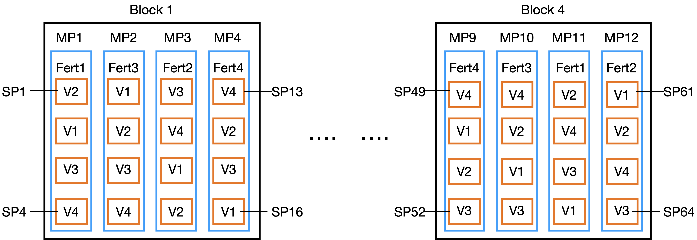
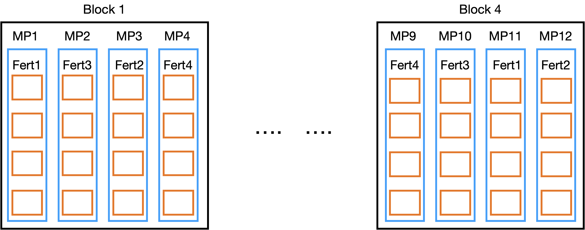

Re-install PLS205 package: 
Run the following command directly in your RStudio console:
`devtools::install_github('deruncie/PLS205_package')`

```{r}
library(ggplot2)
library(emmeans)
library(lme4)
library(lmerTest)
library(car)
library(PLS205)
```

## Objectives

1. Understanding the split-plot experimental design
2. Analyzing specific effects and interactions in a factorial

In this lab, we'll first introduce the split plot design, with the additional complication of the main plots laid out in an RCBD.
The challenge in analyzing split-plots is in correctly setting up the design table, linear model, and diagnostics.
Once this is done, analyzing a split-plot is no different than any other factorial. We'll review how to analyze a factorial.

## Split Plot experiments
Split plots are used when a factorial design is necessary, but at least two treatment factors require different
levels of randomization. Most commonly, issues of time, space, or expense mean that we can't afford as many 
experimental units for one treatment as for the other. For example, in a field, our irrigation system may have only 4 zones, so we can't fit more than 4 experimental units for an irrigation treatment. But genotypes could be planted independently
in many plots throughout the field.

In a split for a two-way factorial, the randomization of the treatment combinations takes two stages:

1. In the first stage, the more-restricted factor is randomized to its experimental units. The common name
for this first level of experimental units is **main plots** because this design was first used in agricultural experiments in fields.
2. Then, in the second stage, the less-restricted factor is randomized to its experimental units **separately within each main plot**.
We commonly call these second-level experimental units **sub-plots** because they are nested within each main plot.

Because of this two-stage process, specific effects for the first-level treatment factor are generally measured with 
less precision than specific effects for the second-level treatment. This is because the main plots serve as blocks
for the experimental units of the second-level treatment (sub-plots), controlling for additional sources of variation,
and because there are more experimental units at the second-level than at the first (higher degrees of freedom).

Nevertheless, the power to detect an interaction is actually not severely reduced by a split-plot relative to a typical factorial experiment with a single level of randomization.

## Split Plot with main plots in an RCBD
In this study, a large field was divided into four blocks, and each block was divided into four strips.
One of four different fertilizers were randomized to each of the strips in each block.
Then, each strip was divided into four plots, and one of four different varieties of oats were randomized
to each of the plots in each strip.
The experiment was run as a split-plot because the fertilizers could only be applied to large strips of the field,
while the oat varieties could be randomized to smaller plots within each section.

Summary:

- Four blocks, divided into 4 strips (called MainPlots)
- Four fertilizer treatments, randomized to MainPlots within each plot
- Four plots within each MainPlot (called SubPlots)
- Four Varieties randomized to each SubPlot within each MainPlot

We will consider Fertilizer "F1" and Variety "V1" the reference levels in the analysis.

Here's a diagram of the experiment. It can be helpful to draw this out for your experiment


### Load the data and inspect
```{r}
oat_data = read.csv('Oats.csv',stringsAsFactors = TRUE)
str(oat_data)
```
The only problem I see is the SubPlot came in as an *int*, and it appears to have only 4 levels instead of 64. 
To fix this, notice that SubPlot is *nested* in MainPlot in the description and diagram above. So we can construct these
level with the `interaction()` function:

```{r}
oat_data$SubPlot = interaction(oat_data$MainPlot,oat_data$SubPlot,drop = T)
str(oat_data)
```
### Model table

| Structure | Variable                      | Type        | # levels | Experimental Unit                     |
|-----------|-------------------------------|-------------|----------|---------------------------------------|
| Treatment | Fertilizer                    | Categorical | 4        | Fertilizer:Block                      |
|           | Variety                       | Categorical | 4        | Variety:Block                         |
|           | Fertilizer:Variety            | Categorical | 16       | Fertilizer:Variety:Block              |
| Design    | Block                         | Categorical | 4        |                                       |
|           | MainPlot                      | Categorical | 16       |                                       |
|           | SubPlot                       | Categorical | 64       |                                       |
|           | Fertilizer:Block              | Categorical | 16       |                                       |
|           | Variety:Block                 | Categorical | 16       |                                       |
|           | Fertilizer:Variety:Block      | Categorical | 64       |                                       |
|           | Variety:MainPlot              | Categorical | 64       |                                       |
|           | Fertilizer:Variety:MainPlot   | Categorical | 64       |                                       |
| Response  | Yield                         | Numeric     | 64       |                                       |


There's a lot going on in this table. 

#### Variables

- I started with the two treatments and their combinations
- I then added the 3 components of the Experimental Design: Block, MainPlot, SubPlot
- I then added terms for all possible combinations between Treatment and Design terms.
However, some potential terms aren't needed. When one term is *Nested* in another term, there are no additional combinations so we don't need the combined term. 
For example, MainPlot is nested in Fertilizer, so we don't need MainPlot:Fertilizer
```{r}
is_nested(Fertilizer~MainPlot,oat_data)
# we can also visualizing the nesting relationship using the is_crossed function. 
# Remember, enclose this function in parentheses to see the table of combinations
(is_crossed(Fertilizer~MainPlot,oat_data))
# from this, we can see that each MainPlot is associated with only 1 Fertilizer, but each Fertilizer is associated with 4 MainPlots.
```
When two terms are **crossed**, though, we do need to add their combinations.
Ex: Block is crossed with: 1) Fertilizer (all Fertilizers in all Blocks), 2) Variety, and 3) the Fertilizer:Variety combinations.
Ex: MainPlot is crossed with Variety (all Varieties in each MainPlot), but NOT Fertilizer

> I'll demonstrate a couple of these, and you can test the rest on your own.

```{r}
(is_crossed(Block~Fertilizer,oat_data))
(is_crossed(Fertilizer~MainPlot,oat_data))
```
When a combination has more possible levels than actually exist, record the number that are observed.
For example, `Fertilizer:Variety:MainPlot` would have `4*4*16 = 256` possible levels, but only 64 are observed:

```{r}
length(levels(interaction(oat_data$Fertilizer,oat_data$Variety,oat_data$MainPlot,drop = F)))  # all possible
length(levels(interaction(oat_data$Fertilizer,oat_data$Variety,oat_data$MainPlot,drop = T)))  # only observed
```

        
#### Experimental Units

We need experimental units for the 3 treatment variables: *Fertilizer*, *Variety*, and *Fertilizer:Variety*

Formally, we need to go through each of the 5 EU rules from class for each term. However, we can take some short-cuts:

In a typical factorial experiment, the randomization occurs for the treatment combinations (in this case it would be: *Fertilizer:Variety*).
No separate randomization procedure would be done for Fertilizer levels or Varieties themselves beyond the randomization of the combinations.
Similarly, no application of the treatments or measurement of the observational units would be done separately for Fertilizer levels of Variety levels.
This means that the EUs for the treatment combinations would then be inherited by the two treatments themselves.

However, in the split plot design, the randomization procedure (assignment of treatment levels to EUs) happens separately for the two (or more)
treatment variables. In this case, Fertilizer levels are assigned to MainPlots and Varieties are assigned to SubPlots, so we might think
that these will be the experimental units.

But, remember that we have *Blocks* too! Remember that when we have blocks, the experimental unit for treatments randomized within blocks is Block:Treatment.
Look back at the experimental design, this time focusing specifically on the Fertilizer levels which were randomized to MainPlots:


From the perspective, the orange boxes (Subplots) are clearly sub-samples, and it's a simple RCBD, so the EU for Fertilizer would be Block:Fertilizer.

Similarly if we focus specifically on the Varieties which were randomized to SubPlots:


From this perspective, both MainPlots and Blocks are blocks for Variety. So MainPlot:Variety or Block:Variety could be the EU. Since
MainPlot:Variety is nested in Block:Variety, if Block:Variety is declared a random effect, then MainPlot:Variety would also because of the nesting, 
so we'll get them both. Basically, you should choose the outer-level of blocks as the base-term for your EU if you have nested levels of blocking.

Finally, looking at the combinations of Fertilizer:Variety:

The MainPlots are *incomplete blocks* for the Fertilizer:Variety combinations. We'll discuss incomplete blocks next week. Blocks are *complete blocks*
for the Fertilizer:Variety combinations. So it's a RCBD with Block as the block, and the EU should be Block:Fertilizer:Variety. Since MainPlot:Fertilizer:Variety
is nested in Block:Fertilizer:Variety, we'll get this declared as random automatically.

So in summary, the EU's we'll declare in the table are:

- *Fertilizer*: Block:Fertilizer
- *Variety*: Block:Variety
- *Fertilizer:Variety*: Block:Fertilizer:Variety

### Linear Model

Here is the final design table:

| Structure | Variable                      | Type        | # levels | Experimental Unit                     |
|-----------|-------------------------------|-------------|----------|---------------------------------------|
| Treatment | Fertilizer                    | Categorical | 4        | Fertilizer:Block                      |
|           | Variety                       | Categorical | 4        | Variety:Block                         |
|           | Fertilizer:Variety            | Categorical | 16       | Fertilizer:Variety:Block              |
| Design    | Block                         | Categorical | 4        |                                       |
|           | MainPlot                      | Categorical | 16       |                                       |
|           | SubPlot                       | Categorical | 64       |                                       |
|           | Fertilizer:Block              | Categorical | 16       |                                       |
|           | Variety:Block                 | Categorical | 16       |                                       |
|           | Fertilizer:Variety:Block      | Categorical | 64       |                                       |
|           | Variety:MainPlot              | Categorical | 64       |                                       |
|           | Fertilizer:Variety:MainPlot   | Categorical | 64       |                                       |
| Response  | Yield                         | Numeric     | 64       |                                       |


Now that we have a completed design table, the linear model is straightforward.

First, we have to identify which terms to include in the model.

Rules:

1. Start with all terms.
2. Remove any terms that have the same # levels as the Response
3. When two terms are *aliased*, include only one. If one is an EU, you need to include that one (if it also passes rule #2).
4. Declare all terms that are Experimental Units of other terms *Random*. 
5. Also declare any terms that are nested within *Random* terms to be *Random*.

We have 4 terms with the same # levels as *Yield*. None of these can be included in the final model.

Terms that have the same # levels *MAY* be aliased.

As discussed above, MainPlot and Fertilizer:Block are *aliased*, so we can only include one. Since Fertilizer:Block is an EU for Fertilizer, we'll choose that one.
Variety:Block and Fertilizer:Variety also have 16 levels, but neither is aliased with Fertilizer:Block (or any other term), so we'll keep both.

Now, we can write our model. Split Plots always require `lmer` because they have multiple Experimental Units.

```{r}
oats_model <- lmer(Yield ~ Fertilizer + Variety + Fertilizer:Variety 
                          + Block + (1|Fertilizer:Block) + (1|Variety:Block)
                          ,data = oat_data
                          )
```

> Note: Block could be declared as Random, but since it's not an EU of any variable, and it's not nested in another random term, doing so will have NO EFFECT on the analysis.

### Diagnostics

Remember back to the discussion about assumptions of linear models. We assume that the EUs are normally distributed within-populations and have equal variances among populations. We've been testing these with the `pls205_diagnostics` function that makes the qqplots and Scale/Location plots.

With this split-plot, we actually have 3 different sets of EU, a different one for each of the 3 treatment variables. So we need to consider the diagnostics for each. We can do this by specifying the different EU one at a time:

```{r}
pls205_diagnostics(oats_model,EU = 'Fertilizer:Block')
pls205_diagnostics(oats_model,EU = 'Variety:Block')
pls205_diagnostics(oats_model,EU = 'Fertilizer:Variety:Block')
```
> All of these look fine to me. The bit of a curve to the red lines in the S/L plots for the first two EU are mostly just caused by a single point each which doesn't look really that far off. The qqplots are all quite good.

### Analysis of the factorial

Now that we have specified our linear model, we can analyze the experiment and produce our results.

A split-plot design is still a factorial, so we'll use the normal strategies for analyzing factorials.

1. Decide on which treatment is the *focal treatment* and which is the *moderator treatment*
2. Decide if the goal is to report *specific effects* or *interactions*.

In this example, we'll use *Variety* as our focal treatment and *Fertilizer* as our moderator. We'll first analyze the specific effects, and then the interactions.

#### Specific effects
The specific effects of Variety are the effects of Variety *at each level of Fertilizer*.

To test if *any specific effect is != 0*, we can use ANOVA, but we have to re-write our model statement to *drop all terms for Variety that the Fertilizer:Variety combination term is nested in*. In this case, that means dropping *Variety* from our model:
```{r}
oats_model_variety = lmer(Yield ~ Fertilizer + Fertilizer:Variety 
                          + Block + (1|Fertilizer:Block) + (1|Variety:Block)
                          ,data = oat_data
                          )
```

Then we can use an ANOVA to test the null hypothesis that there are no differences among Varieties at any level of fertilizer:
```{r}
anova(oats_model_variety,ddf = 'K')
```
In this table, we *only look at the Fertilizer:Variety* row. The p-value is small, so we can say that there is weak evidence that Varieties do differ at least a some level of Fertilizer. But which ones?

To report these specific effects, we use emmeans. We could use either our original model, or this new model (they are actually identical for emmeans):
```{r}
variety_means = emmeans(oats_model,spec = 'Variety',by = 'Fertilizer')
variety_effects = contrast(variety_means,method = 'trt.vs.ctrl',ref = 'V1')
summary(variety_effects,infer = T,level =1-0.05/4)
```
> Note: I adjusted the level of the confidence intervals to .9875 = 1-0.05/4 because emmeans does the multiple-testing corrections for each group of Dunnett tests separately. We can see this because it reports: "Conf-level adjustment: dunnettx method for 3 estimates" where 3 is the number of estimates in each group.

We can visualize these specific effects like this:
```{r}
plot(variety_effects,level = 1-0.05/4)  # remember to adjust your level here too!
```
> Which specific effect(s) can we declare significant? How would you interpret them? Come up with a sentence describing these results.

#### Interaction effects
Interaction effects are *changes* in the specific effects from one level of the moderator to another.
In this case, we'd be interested in whether the difference between V2 and V1 changes from Fertilizer F1 to F2, or other similar comparisons.

We can test if there is any evidence of an interaction using an ANOVA. This must be with the original model with all 3 treatment terms.

```{r}
anova(oats_model,ddf='K')
```
> Check your ANOVA for both "main effect" rows. Again, we ONLY look at Fertilizer:Variety row for our answer. Here again, we have fairly week evidence that the Variety effects do change among the different Fertilizer treatments.

Before we calculate these, let's visualize the interactions using an interaction plot. The `emmip` function gives a quick way to produce interaction plots:

```{r}
emmip(oats_model,Variety~Fertilizer,CIs = T)
```
> This shows the means of each Variety at each Fertilizer. Where do you think the interactions are from looking at this?

> It looks to me like the variety differences between V1/V4 and V2/V3 change a lot between F1 and the others (particularly V4). Let's see if the actual estimates support this.

To estimate the interactions, we first have to estimate the specific effects (as above), and then we can make contrasts among the specific effects.
We'll continue with the trt.vs.ctrl-type contrasts because it's easier to show. But you could do all pairwise contrasts in the same way.

The procedure will be:

1. Estimate specific effects relative to V1 for each Fertilizer (e.g. V2-V1 for F1 and V2-V1 for F2)
2. Re-group the specific effects by contrast (i.e. pull all the V2-V1 contrasts together)
3. Compare each group of contrasts among the Fertilizer levels (e.g. (V2-V1)|F2 - (V2-V1)|F1)

Estimate specific effects relative to V1 for each Fertilizer (e.g. V2-V1 for F1 and V2-V1 for F2):
```{r}
variety_means = emmeans(oats_model,spec = 'Variety',by = 'Fertilizer')
variety_effects = contrast(variety_means,method = 'trt.vs.ctrl',ref = 'V1')
summary(variety_effects,infer = T,level =1-0.05/4)
```
Re-group by contrast:
```{r}
variety_effects_by_contrast = emmeans(variety_effects,spec = 'Fertilizer',by = 'contrast')
variety_effects_by_contrast
```
Compare the same contrast among the fertilizers. Repeat for each contrast:
```{r}
interaction_effects = contrast(variety_effects_by_contrast,method = 'trt.vs.ctrl',ref = 'F1')
summary(interaction_effects,infer = T,level = 1-0.05/3)
```
> Note: here we adjust for 3 groups of interaction effects, one for each of the Variety comparisons against the control variety (V1).
> At this level, we can declare only one interaction significant:
> (V2-V1) differs between F3 and F1 (p < 0.05/3 = 0.0167)

Let's go back to the visualization:
```{r}
emmip(oats_model,Variety~Fertilizer,CIs=T)
```
Now, let's plot the specific effects:
```{r}
emmip(variety_effects,contrast~Fertilizer,CIs=T)
```
> Here, the Y-axis is the "contrast", ie the difference in mean between V2-4 and V1. We see that the V3/V4 effects were greatest relative to V1 in F1, but much smaller (or maybe even negative with the other Fertilizers). This is an indication of an interaction.

Finally, we can plot the interaction effects:
```{r}
emmip(interaction_effects,contrast~contrast1,CIs=T)
```
> Convince yourself that these are the interactions. Why is the red line at ~-10 for F2-F1 and ~-17 for F3-F1? You should be able to predict these values from either of the previous two figures.

> The names of the contrasts here are pretty awkward. To see what they are called, view the emmeans results table and look what they're called there:

```{r}
interaction_effects
```
> See that the contrasts among Varieties (e.g. V2-V1) are called "contrast" and the contrasts among Fertilizers (e.g. F2 - F1) are called "contrast1"
Similarly if we look at the specific effects, we can find the names to use ("contrast" and "Fertilizer")

```{r}
variety_effects
```

## Summary

Understanding the Split-plot design and identifying the experimental units can be tricky. But once that is done, analyzing a split-plot experiment is no different than analyzing a factorial.

For a factorial, we either want to report specific effects or interaction effects, so depending on the goal, choose the section above to follow.
